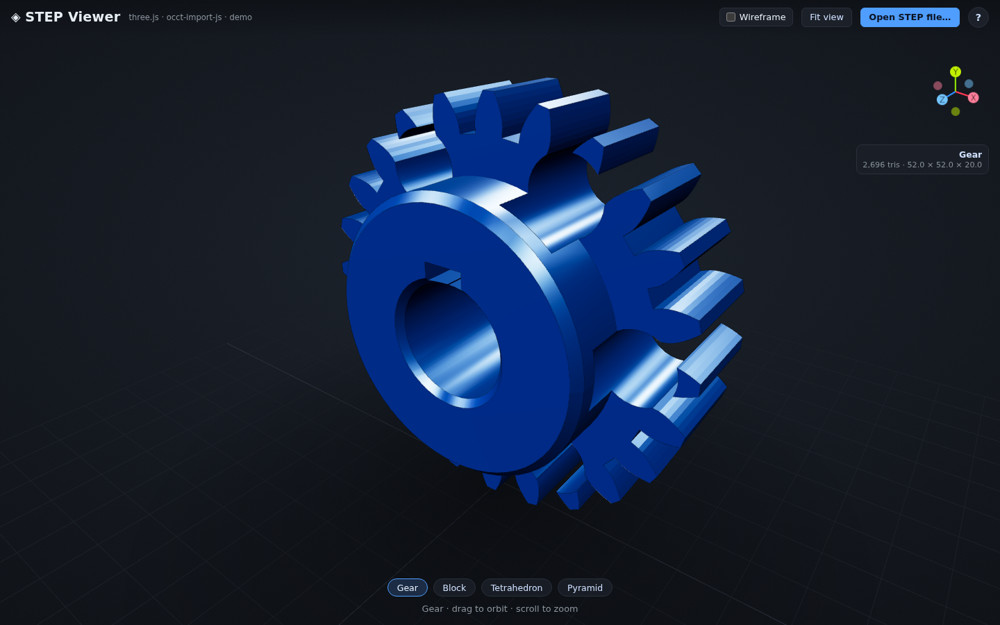

# STEP Viewer Demo

A zero-build, browser-based viewer for **STEP** (ISO 10303) CAD models — rendered with
[three.js](https://threejs.org) and parsed with
[occt-import-js](https://github.com/kovacsv/occt-import-js) (OpenCascade compiled to
WebAssembly). No bundler, no `npm install`: it's plain ES modules loaded from a CDN, so
you serve the folder and it runs.

## What it does

- Loads a bundled **sample gallery** of STEP (and an IGES) model with one click.
- **Open your own** `.step` / `.stp` / `.iges` / `.igs` / `.brep` / `.brp` file via the
  picker or by dragging it anywhere onto the window — the loader routes each format to the
  matching occt-import-js reader (STEP / IGES / BREP).
- Parses the B-rep with occt-import-js (WASM) and renders the resulting meshes with
  three.js — orbit / pan / zoom via `OrbitControls`.
- Viewer polish: camera auto-fits to the model, a **wireframe** toggle (button or `W`
  key), a loading spinner while parsing, and a non-blocking error toast on bad input.
- **Keyboard-navigable camera** — Tab to the 3D view and drive orbit / zoom / pan
  entirely from the keyboard (see below), so the viewer is usable without a mouse.

## Keyboard controls

Most shortcuts work anywhere on the page. The **camera keys** are scoped to the 3D
view — `Tab` to it first (it shows a focus ring), then:

| Key | Action |
|-----|--------|
| `←` `→` `↑` `↓` | Orbit the camera (~5° per press) — Left/Right azimuth, Up/Down polar |
| `+` `−` | Zoom (dolly) the camera in / out, clamped to the fit bounds |
| `Shift` + arrows | Pan the view target |
| `Home` | Re-fit / reset the view |

Global shortcuts (work regardless of focus): `1`–`5` load the gallery samples,
`W` toggles wireframe, `F` / `R` fit the view, `?` opens the shortcuts help.

## Live demo

**https://aatchison.github.io/step-viewer-demo/**

## Screenshot



*The bundled `Gear` sample (2,696 tris, 52.0 × 52.0 × 20.0) loaded at a 1440×900 desktop
viewport. Pick another model from the gallery strip, drag in your own STEP / IGES / BREP
file, and orbit / pan / zoom with the mouse.*

## Run locally

It's a static site — serve the folder with any web server:

```bash
python3 -m http.server 8000
# then open http://localhost:8000
```

(occt-import-js loads its WASM over the network, so a plain `file://` open won't work —
use a server.)

## Development / CI

The **site stays zero-build** — `index.html` loads three.js and occt-import-js from a
CDN via an importmap, and nothing here is bundled or shipped. Everything under
`package.json` / `node_modules` is **dev-only**: it exists so the sample-parse tests can
run the exact same occt-import-js engine (pinned to the CDN version) in Node.

```bash
npm ci               # install the dev-only test + typecheck dependencies
npm test             # run the node:test sample-parse regression suite (no browser)
npm run typecheck    # tsc --noEmit: JSDoc + checkJs across the split modules (no output)
```

`npm run typecheck` is **dev-only static type-checking** (issue #111): the ES
modules under `src/` are annotated with JSDoc `@param`/`@returns`/`@throws` and
topped with `// @ts-check`, and `tsc --noEmit` (config in `tsconfig.json`) catches
parameter/shape mismatches across the split files. It **emits no JavaScript** — the
shipped `index.html` / `src/*.js` are byte-for-byte unchanged and the site stays
zero-build. (three@0.160.0 doesn't bundle its own `.d.ts`, so three's types come
from the pinned `@types/three@0.160.0` devDependency — the same version as the CDN
runtime engine.)

A GitHub Actions workflow runs `npm ci`, then `npm test` and `npm run typecheck`, on
every push / PR to `main` (Node 20, `ubuntu-latest`, read-only `GITHUB_TOKEN` via
`permissions: contents: read`).

**Note:** this commit only *proposes* the workflow. The automation token that opened the
PR lacks GitHub's `workflow` scope — and GitHub refuses any push that touches
`.github/workflows/` without it — so the ready-to-run file ships at
[`.github/workflows-proposed/ci.yml`](.github/workflows-proposed/ci.yml). A **maintainer
with `workflow` scope enables it** by moving it into place:

```bash
git mv .github/workflows-proposed/ci.yml .github/workflows/ci.yml
git commit -m "ci: enable workflow" && git push
```

## Supported formats

occt-import-js bundles readers for three CAD formats, and the viewer dispatches on the
file extension to the matching one:

- **STEP** — `.step` / `.stp` (ISO 10303, AP203 / AP214 / AP242).
- **IGES** — `.iges` / `.igs`.
- **BREP** — `.brep` / `.brp` (OpenCascade native).

All six extensions are accepted by the picker and drag-and-drop; an unrecognized
extension is rejected up front with a hint rather than a failed parse. Other CAD formats
(STL, OBJ, …) are out of scope for this demo.

## Feature train

| # | Feature | Status |
|---|---------|--------|
| 1 | Project scaffold — three.js scene, OrbitControls, lighting | ✅ |
| 2 | STEP loader core — occt-import-js WASM → three.js meshes | ✅ |
| 3 | File upload — drag-and-drop / picker for `.step`/`.stp` | ✅ |
| 4 | Sample gallery — bundled sample models, one-click load | ✅ |
| 5 | Viewer polish — auto-fit camera, wireframe toggle, spinner, error toast | ✅ |
| 6 | Docs — usage, screenshot, credits, live demo link | ✅ |

## Credits

This demo stands on two open-source projects:

- **[three.js](https://threejs.org)** — WebGL 3D rendering
  ([source](https://github.com/mrdoob/three.js),
  [MIT License](https://github.com/mrdoob/three.js/blob/dev/LICENSE)).
- **[occt-import-js](https://github.com/kovacsv/occt-import-js)** — STEP/IGES import via
  OpenCascade compiled to WebAssembly
  ([MIT License](https://github.com/kovacsv/occt-import-js/blob/main/LICENSE.md)). It
  wraps **[Open CASCADE Technology](https://dev.opencascade.org/)**, which is licensed
  under the
  [LGPL-2.1 with an additional exception](https://dev.opencascade.org/resources/licensing).

Both libraries are loaded at runtime from the [jsDelivr](https://www.jsdelivr.com/) CDN.

## License

MIT — see [LICENSE](./LICENSE).
